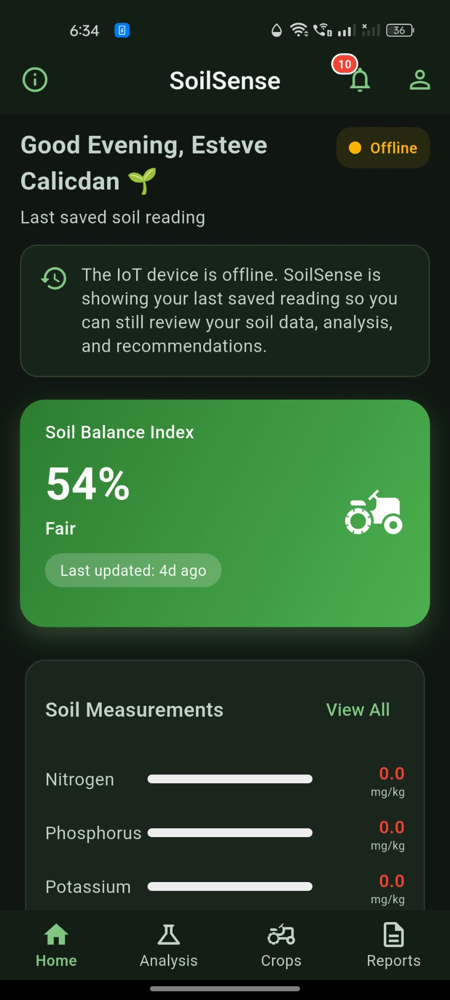
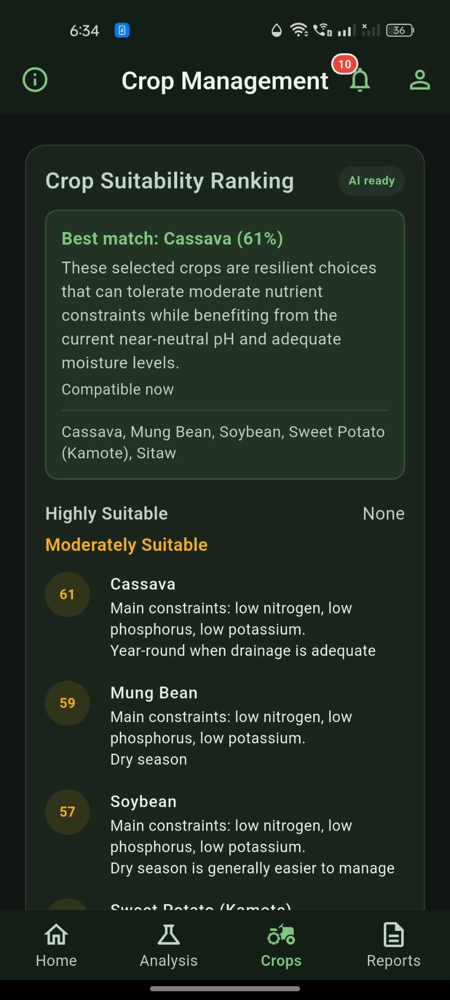
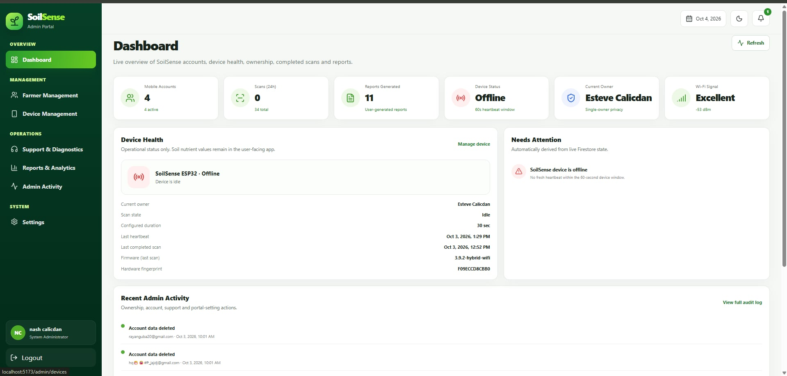
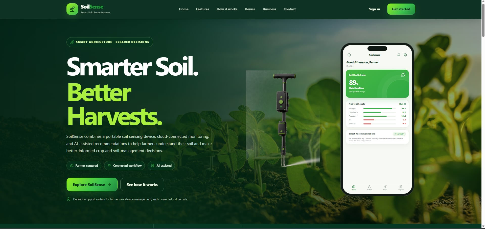
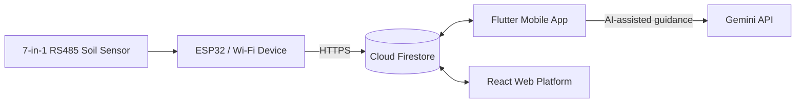

<div align="center">

# SoilSense

**AI-Powered Soil Components Detection and Crop Management Decision Support System**

A completed academic capstone project that combines an **ESP32-based soil sensing device**, an **Android mobile application**, and a **web platform** for administration, monitoring, and decision support.

**Flutter · React · Vite · ESP32 · Firebase · Gemini API**

</div>

---

## Overview

SoilSense is a smart agriculture prototype designed to help farmers and agricultural users monitor soil conditions and make better crop-management decisions. The system captures soil measurements through a portable IoT device, stores and synchronizes data in Firebase, presents readings and recommendations in a mobile app, and provides administration tools through a web portal.

The project was built as a **capstone prototype** for educational and demonstration purposes. It is intended to support soil monitoring and crop decision-making, not to replace laboratory testing or professional agronomic assessment.

## Key Features

- **Mobile application** for soil monitoring, crop analysis, historical records, and report generation
- **AI-assisted recommendations** for crop suitability ranking and Smart Crop Plan guidance
- **ESP32-based IoT device** connected to a 7-in-1 RS485 soil sensor
- **Web platform** with a public landing page and an admin portal for device ownership, account management, and monitoring
- **Firebase-backed cloud system** for authentication, Firestore data storage, and synchronized records
- **Single-owner privacy model** so new readings belong only to the currently assigned device owner

**Measured soil properties:**
- Nitrogen (N)
- Phosphorus (P)
- Potassium (K)
- pH
- Moisture
- Temperature
- Electrical Conductivity (EC)

## Interface Preview

### Mobile Application

| Home Screen | Crop Management |
| :---: | :---: |
|  |  |

### Web Platform

| Admin Dashboard | Public Landing Page |
| :---: | :---: |
|  |  |

## System Architecture



## Technology Stack

| Layer | Technologies |
| --- | --- |
| Mobile | Flutter, Dart, Firebase Authentication, Cloud Firestore, Firebase Messaging |
| Web frontend | React, Vite, Tailwind CSS, Firebase JavaScript SDK |
| Web backend | Node.js |
| IoT / Firmware | ESP32, Arduino/C++, RS485 soil sensor |
| Cloud services | Firebase Authentication, Cloud Firestore, Firebase Storage |
| AI integration | Gemini API |

## Repository Structure

```text
SoilSense/
├── mobile/                   # Flutter Android application
├── web/
│   ├── frontend/             # Public site and admin portal (React + Vite)
│   └── backend/              # Optional Node.js backend service
├── iot/
│   └── esp32_soilsense/      # ESP32 firmware
├── docs/
│   └── screenshots/          # README images
├── .firebaserc
├── firebase.json
├── firestore.rules
├── firestore.indexes.json
├── storage.rules
└── README.md
```

## How to Run the Project

### Prerequisites

Install the following first:

- **Git**
- **Flutter SDK** and **Android SDK**
- **Node.js** and **npm**
- **Arduino IDE** with **ESP32 board support**
- **Firebase CLI**
- A configured **Firebase project**

## Quick Start

### 1. Clone the repository

```bash
git clone https://github.com/USERNAME/SoilSense.git
cd SoilSense
```

### 2. Configure Firebase

From the repository root, deploy the included Firebase configuration:

```bash
firebase login
firebase use soilsense-db59e
firebase deploy --only firestore:rules,firestore:indexes,storage
```

If you are using a different Firebase project, update the project selection and make sure the mobile app, web app, and firmware all point to the same Firebase environment.

### 3. Run the web platform

```bash
cd web/frontend
cp .env.example .env
npm ci
npm run dev
```

Then fill in the values inside `web/frontend/.env` using your Firebase web app settings.

For production build:

```bash
npm run build
npm run preview
```

### 4. Run the mobile application

```bash
cd mobile
flutter pub get
flutter run
```

If AI-assisted features are needed during development:

```bash
flutter run --dart-define=GEMINI_API_KEY=YOUR_GEMINI_API_KEY
```

Make sure `mobile/lib/firebase_options.dart` and `mobile/android/app/google-services.json` match the Firebase project you want to use.

### 5. Upload the ESP32 firmware

Open the following file in Arduino IDE:

```text
iot/esp32_soilsense/esp32_soilsense.ino
```

Install the required ESP32 board package and libraries, check the wiring, then flash the firmware to the ESP32.

### 6. End-to-end workflow

To make the full system work properly:

1. Deploy the Firebase rules and indexes.
2. Configure the web app Firebase environment variables.
3. Confirm the mobile app Firebase configuration is correct.
4. Flash the ESP32 firmware.
5. Sign in to the web admin using an admin account.
6. Assign the device owner in the admin portal.
7. Connect the SoilSense mobile app and complete Wi-Fi setup for the device.
8. Start a scan and verify that readings are saved to Firestore.
9. Open the mobile app to view soil measurements, analysis, crop suitability, and reports.

## Build and Deployment

### Mobile

```bash
cd mobile
flutter build apk
```

### Web

```bash
cd web/frontend
npm run build
```

For **Vercel deployment**:
- Root directory: `web/frontend`
- Framework preset: **Vite**
- Output directory: `dist`

### Backend (optional)

```bash
cd web/backend
cp .env.example .env
node server.js
```

## Project Documentation

- [docs/SETUP.md](docs/SETUP.md) – detailed setup and deployment guide
- [docs/SECURITY.md](docs/SECURITY.md) – security notes and deployment cautions
- [mobile/README.md](mobile/README.md) – mobile app folder guide
- [web/README.md](web/README.md) – web platform folder guide
- [iot/README.md](iot/README.md) – firmware folder guide

## Project Status

SoilSense is presented here as a **completed academic capstone prototype**. The repository contains the mobile app, web platform, ESP32 firmware, and Firebase configuration needed to study, run, and demonstrate the project.

## Important Notes

- Internet access is required for cloud synchronization and AI-assisted recommendations.
- Gemini-based AI guidance is intended for prototype and demonstration use.
- The system is best treated as a decision-support tool, not a replacement for formal soil laboratory analysis.
- Before public or production deployment, review the security implications of direct device-to-Firestore communication and client-side AI usage.

---

<div align="center">

**SoilSense — smarter soil monitoring for better crop decisions.**

</div>
